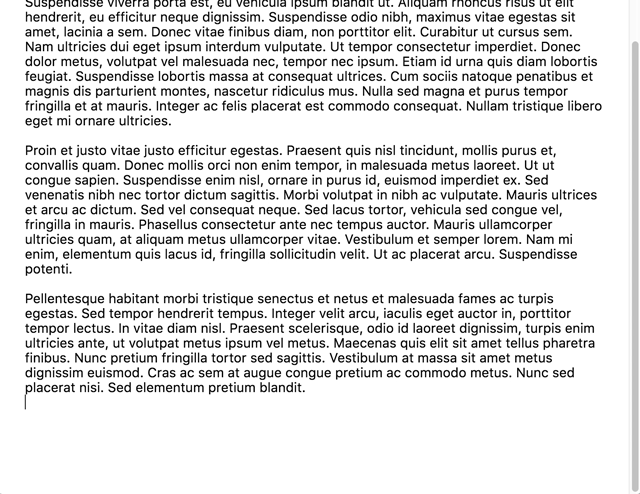

# typewrite
`typewrite` adds typewriter scrolling to a textarea.

## About typewriter scrolling
Typewriter scrolling keeps a user's caret at a constant y-position on the screen. When the user types text preceding the caret moves up, as on a typewriter, instead of the caret moving down. This  ensures the user never has to type at the bottom edge of the screen and can always view the text immediately surrounding the caret on either side. Most dedicated prose editors (e.g., WriteRoom, Scrivener, Ulysses) have typewriter scrolling options.



## Example
```html
<textarea></textarea>
```

```js
var typewrite = require('typewrite');
var textarea = document.querySelector("textarea");
typewrite(textarea);
```

(Use [browserify](http://browserify.org) or equivalent to require npm modules in web apps.)

## Autosize
`typewrite` depends on [autosizing](https://github.com/jackmoore/autosize) textareas. I might fix that later, but for now if you don't want autosize, just wrapping your `textarea` in a div with `overflow-y:auto` should work.

### Options
The second argument to `typewrite()` may be an options object:

```js
typewrite(textareaElement, {
  scrollingCutoff: 0.7,
  bottomMarginSize: 0.3
});
```

#### scrollingCutoff
Default: 0.7

Controls the y-coordinate below which to enable typewriter scrolling. Function accepting the container height and the caret position (in pixels) and returning true or false.

```js
// typewriter scrolling enabled when caret is in the bottom 30% of the container
options.scrollingCutoff = function(caretYPosition, writingAreaHeight) {
  return caretYPosition / writingAreaHeight > 0.7;
};
```

scrollingCutoff can also be a number indicating the fraction of the container height below which scrolling should be enabled.

```js
// typewriter scrolling enabled when caret is in the bottom 30% of the container
options.scrollingCutoff = 0.7;
```

#### bottomMarginSize
Default: 0.3

Controls the size of the blank space after the last line. Function accepting the container height and returning a number in pixels.

```js
// space will be 30% of the container height
options.bottomMarginSize = function(containerHeight) {
  return containerHeight * 0.3;
}
```

bottomMarginSize can also be a number indicating the fraction of the height of the container the space should be.

```js
// space will be 30% of the container height
options.bottomMarginSize = 0.3;
```
